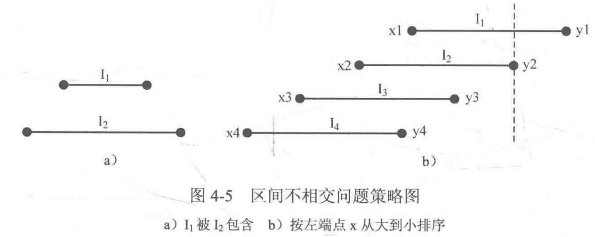

# 贪心
贪心是只考虑当下的一种局部最优（或较优），来使全局结果达到最优（或较优）的策略。    
证明策略是最优（或较优）的：反证法、数学归纳法【证明较复杂，若有不错的思路且无法找到反例，直接实现即可】
## 简单贪心
🌰  PAT B1020（卖月饼P118）     
📣  只在乎销售额，只要每次选最贵的就能达到总销售额最多（贪心）。
```c
#include<cstdio>
#include<algorithm>
using namespace std;

struct mooncake { // 结构体整合输入数据
    double store; // 库存
    double sell; // 总价
    double price; // 单价（库存除总价）
}cake[1010];

bool cmp(mooncake a, mooncake b) {
    return a.price > b.price;
}

int main() {
    int n; // 月饼种类数
    double D; // 月饼需求量
    scanf("%d%lf", &n, &D);
    for(int i = 0; i < n; i++) { // 输入库存
        scanf("%lf", &cake[i].store);
    }
    for(int i = 0; i < n; i++) { // 输入总价 并计算单价
        scanf("%lf", &cake[i].sell);
        cake[i].price = cake[i].sell / cake[i].store;
    }
    sort(cake, cake + n, cmp); // 按单价从高到低排序
    double ans = 0; // 收益
    for(int i = 0; i < n; i++) { // 遍历排序后的月饼列表cake
        if(D >= cake[i].store) { // 需求大于供应
            D -= cake[i].store;
            ans += cake[i].sell; // 该类月饼全部卖出
        } else { // 需求小于供应
            ans += cake[i].price * D; // 需求全部满足
            break;
        }
    }
    printf("%.2f\n", ans);
    return 0;
}
```

🌰  PAT B1023（组个最小数）    
📣  只要每次都拿最小的数放在最高位，最后组成的数必然最小（贪心）。  
```c
#include<cstdio>

int main() {
    int count[10]; // 记录数字0~9的个数
    for(int i = 0; i < 10; i++) {
        scanf("%d", count + i); // 录入0~9各数字个数
    }
    for(int i = 1; i < 10; i++) {
        if(count[i] > 0) {
            printf("%d", i); // 输出除0外最小的数作为最高位
            count[i]--;
            break;
        }
    }
    for(int i = 0; i < 10; i++) {
        for(int j = 0; j < count[i]; j++) { // 把i输出count[i]次
            printf("%d", i);
        }
    }
    return 0;
}
```
## 区间贪心
给出若干小区间，看最多能塞多少个
```c
#include<cstdio>
#include<algorithm>
using namespace std;
const int maxn = 110;
struct Interval{
    int x, y;
}I[maxn];

bool cmp(Interval a, Interval b) {
    if(a.x != b.x) return a.x > b.x; // 左端点从大到小
    else return a.y < b.y; // 左端点相同时，右端点从小到大（写b.y > a.y容易理解错）
}

int main() {
    int n;
    while(scanf("%d", &n), n != 0) { // 输入提供选择的区间个数
        for (int i = 0; i < n; i++)
        {
            scanf("%d%d", &I[i].x, &I[i].y); // 顺序输入区间的左右端点
        }
        sort(I, I + n, cmp); // 把区间排序
        int ans = 1, lastX = I[0].x; // ans记录不相交区间数，lastX记录上一个被选区间的左端点
        for(int i = 1; i < n; i++) {
            if(I[i].y <= lastX) { // 若该区间右端点在lastX左边
                lastX = I[i].x; // 以I[i]作为新选中的区间
                ans++; // 区间数++
            }
        }
        printf("%d\n", ans);
    }
    return 0;
}
```
## 稍微复杂的贪心策略
