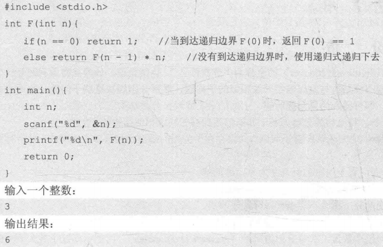
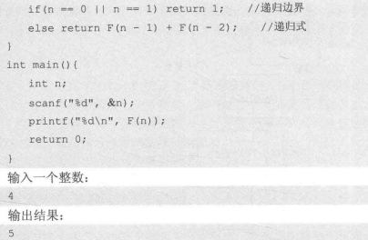

## 递归
两个重要概念：  
1. 递归边界  
2. 递归式（递归调用）   


其中的递归式是将原问题分成若干子问题的手段，递归边界则是分解的尽头。（如果没有尽头就会无限分解）

### 🌰 使用递归求解n的阶乘


### 🌰 求Fibonacci数列的第n项


### 🌰 全排列（Full Permutation）
一个数列所有的排列方式的集合称为全排列。

【举例】如1,2,3的全排列：(1,2,3),(1,3,2),(2,1,3),(2,3,1),(3,1,2),(3,2,1)；（按字典序）

【目的】按字典序从小到大输出全排列：其中(a1,a2,...an)的字典序小于(b1,b2,...bn)，是指存在一个i，使得a1=b1,a2=b2,……,ai<bi成立；
```c
#include<cstdio>
const int maxn = 11; // max number
int n, p[maxn], hashTable[maxn] = {false}; 
// p: Now permutation, hashTable: Record whether x has been placed in p

void generateP(int index)
{
    if(index == n + 1) // recursion boundary
    {
        for(int i = 1; i <= n; i++) // print result
        {
            printf("%d", p[i]);
        }
        printf("\n");
        return;
    }
    for(int x = 1; x <= n; x++)
    {
        if(hashTable[x] == false) // x hasn't been used
        {
            p[index] = x; // use x (place x in p)
            hashTable[x] = true; // x has been used
            generateP(index + 1); // recursion (resolve the sub-problems when p[index] = x)
            hashTable[x] = false; // restore the x (resolved)
        }
    }
}

int main()
{
    n = 3; // want to print 1~3 full permutation
    generateP(1); // recursion start from 1
    return 0;
}
```

### 🌰 n皇后问题
```c
#include<cstdio>
#include<cmath>
#include<algorithm>
using namespace std;

const int maxn = 11;
int n, P[maxn], hashTable[maxn] = {false};// p: 当前排列, hashTable: 记录x是否已经放入pint counter = 0;

void generateP1(int index){
    /* 递归边界 生成一个排列 */ 
    if(index == n + 1){
        bool flag = true; // 当前排列合法 
        /* 遍历任意两个皇后 */ 
        for(int i = 1; i <= n; i++){
            for(int j = i + 1; j <= n; j++){
                for(int j = i + 1; j <= n; j++){
                    if(abs(i - j) == abs(P[i] - P[j])){ // 在同一对角线上 
                        flag = false; // 冲突 
                    }
                }
            }
        }
        if(flag) counter++;
        return; 
    }
    for(int x = 1; x <= n; x++){
        if(hashTable[x] == false){
            P[index] = x;
            hashTable[x] = true;
            generateP1(index + 1);
            hashTable[x] = false;
        }
    }
}
void generateP2(int index){
    /* 递归边界 */ 
    if(index == n + 1){
        counter++;
        return;
    }
    /* 遍历行 */ 
    for(int x = 1; x <= n; x++){
        /* 若第x行还没皇后 */ 
        if(hashTable[x] == false){
            bool flag = true; // flag为true表示不会与之前的皇后冲突 
            /* 遍历之前的皇后 */ 
            for(int pre = 1; pre < index; pre++){ 
                /* 判断是否冲突 */ 
                if(abs(index - pre) == abs(x - P[pre])){
                    flag = false; // 冲突（在同一对角线）
                    break; // 跳出循环 
                }
            }
            /* 无冲突则放置皇后 */ 
            if(flag) {
                P[index] = x;
                hashTable[x] = true; //占用第x行 
                generateP2(index + 1); // 处理下一行（子问题） 
                hashTable[x] = false; // 子问题都处理完了，还原第x行状态 
            }
        }
    }
}

int main(){
    n = 8; // 棋盘大小 n*n
    generateP2(1); //从P[1]开始填 
    printf("%d\n", counter);
    return 0;
}
```


> n皇后问题方法总结   
**普通枚举（暴力）**：随意选取空位摆放。（需要在n²中选n个排列组合算一下次数很多。）   
**全排列（暴力）**：
按列/行逐个摆下去。把所有的子问题都遍历处理到底，<font color=cornflowerblue>**最后**</font>再<font color=cornflowerblue>**检测**</font>是否符合要求（见generateP1方法）     
**全排列（<font color=blue>回溯</font>）**：
按列/行逐个摆下去。<font color=cornflowerblue>**过程中**</font>增加<font color=cornflowerblue>**检测**</font>功能，即若继续放已经不再可能达成目标，则不再遍历处理子问题，立即返回（见generateP2方法）

<font color=grey>通枚举要处理行冲突、列冲突、对角线冲突，全排列只需处理对角线冲突</font>