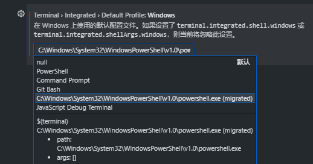

# vscode中配置默认终端
## 原方法
在设置中找到Terminal › Integrated › Shell: Windows配置项，把它的值改为终端启动路径。
## 新方法
配置默认 shell 的新推荐方法
1. 在 Terminal › Integrated › Profiles: Windows 中创建一个终端配置文件
2. 将其配置文件名称设置为 Terminal › Integrated › Default Profile: Windows 中的默认值。

执行完后，运行终端可能会提示迁移配置，点击迁移就ok了。

此操作当前将优先于新的配置文件设置，但将来会发生更改。

🌰 修改默认配置PowerShell

🖥️ 唤起终端    
<button>ctrl</button>+<button>shift</button>+<button>`</button>